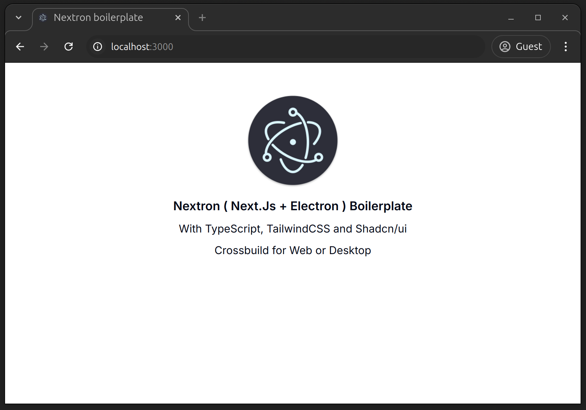

<p align="center"></p>
<h1 align="center"><a href="https://github.com/MaximePremont/boilerplate-nextron-shadcn">Boilerplate Nextron + Shadcn/ui</a></h1>
<p align="center"></p>
<h1 align="center">Nextron ( Next.Js + Electron ) project boilerplate in TypeScript, with TailwindCSS + Shadcn/ui, web and desktop crossbuild</h1>

## Introduction
This repository is a Nextron ( Next.Js + Electron ) project template in TypeScript with a Next.Js 14 App Router that includes TailwindCSS and the Shadcn/ui component library. This project is also configured so that the application can be built for both web and desktop versions with the same code.

The aim of this project is to enable anyone to quickly and easily start up a project using these technologies.
## Installation
**How to create a new application with this template ?**  
There are two ways to create a new project with this template. This project uses and runs under Node 20, so it's advisable to use [NVM](https://github.com/nvm-sh/nvm) to manage and use the correct version of Node.
### Installation method 1 ( recommanded! ) :
To create a new project, use the command below :
```
# with npx
$ npx install-nextron-shadcn-boilerplate

# with yarn
$ SOON

# with pnpm
$ SOON
```
### Installation method 2 :
On GitHub, select this repository as a template.
### Installation method 3 :
To create a new project, just copy it by running :
```
git clone git@github.com:MaximePremont/boilerplate-nextron-shadcn.git
```
**Then, install depedencies by running `npm install` in the project folder.**
## Usage
### Run Next ( web application ) in dev mode :
You can use `npm run next:dev` to start a next web application in development mode with hot reload.
### Run Electron ( desktop application ) in dev mode :
You can use `npm run electron:dev` to start an electron desktop application in development mode with hot reload.
### Build & Start Next ( web application ) :
You can build your next web application by using `npm run next:build`. Then you can start it in production mode with `npm run next:start`.
### Build Electron ( desktop application ) :
You can build your Electron desktop application on different systems by using the commands bellow :
```
npm run electron:build-current        Build for current system
npm run electron:build-all            Build on all systems
npm run electron:build-win32          Build on Windows x32
npm run electron:build-win64          Build on Windows x64
npm run electron:build-linux          Build for linux*
npm run electron:build-mac            Build for MacOs**
npm run electron:build-mac-universal  Universal build for MacOs**
```
*For linux, you can change the package type ( snap, deb... ) by editing the [electron-builder.yml](./electron-builder.yml) file. You may need to install some packages ( for exemple rmp to build a `rpm`).

**MacOs versions can only be build using a Mac.

**For full usage, please read the [Nextron documentation](https://github.com/saltyshiomix/nextron).**
## Shadcn/ui
To install Shadcn/ui components, just use `npx shadcn@latest add MY-COMPONENT` as explained in the [official documentation](https://ui.shadcn.com/docs/installation/next).
## Code format
Eslint and Prettier are installed and configured to work with the project. Feel free to edit configuration files according to your preferences.

_Please note that contributors to this project must adhere to the defined standard._
## Contributing
Feel free to improve this project by developing ( [contribution guide](#) ) or participating in [community discussions](https://github.com/MaximePremont/boilerplate-nextron-shadcn/discussions).
## Maintainers
- [Maxime Premont](https://github.com/MaximePremont)
## License
This project in under the [MIT License](./LICENSE).
## Related
- [nextron](https://github.com/saltyshiomix/nextron)
- [shadcn-ui](https://github.com/shadcn-ui/ui)

---

#### This project was helpfull ? Don't forget to leave a star, thank you ! ⭐